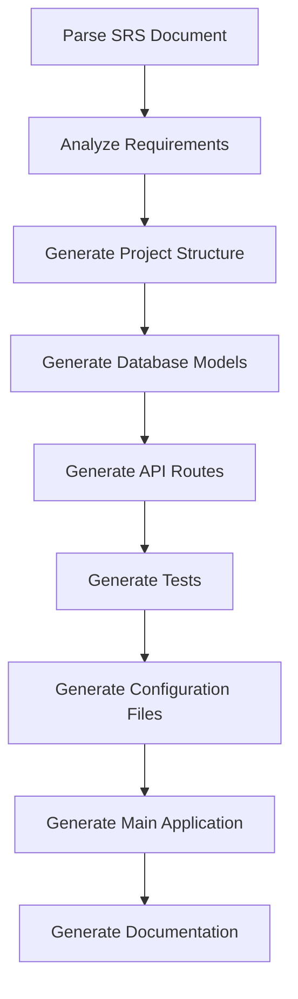

# LangGraph Workflow

## Workflow Nodes

1. **Parse SRS Document**: Extract text content from the SRS document
2. **Analyze Requirements**: Extract API endpoints, database schema, business logic, and authentication requirements
3. **Generate Project Structure**: Create the basic project directory structure
4. **Generate Database Models**: Create SQLAlchemy models based on the database schema
5. **Generate API Routes**: Create FastAPI routes based on the API endpoints
6. **Generate Tests**: Create pytest tests
7. **Generate Configuration Files**: Create configuration files like requirements.txt, Dockerfile, etc.
8. **Generate Main Application**: Create the main FastAPI application file
9. **Generate Documentation**: Create documentation for the API and workflow
